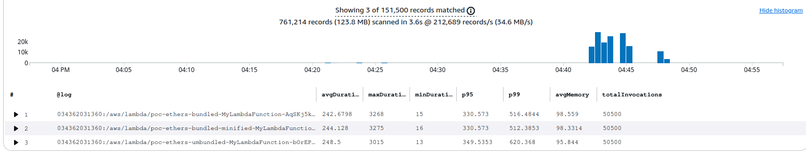

# 📸 Benchmark Visuals and AWS Console Screenshots

This document includes AWS Console screenshots captured during the benchmarking process.

---

## 📊 CloudWatch Logs Insights — Query Output

This query extracted average duration, p95/p99 latency, and memory usage from `REPORT` logs for all Lambda variants.

---

## ❄️ Lambda Insights — Cold Start Comparison

... TODO
